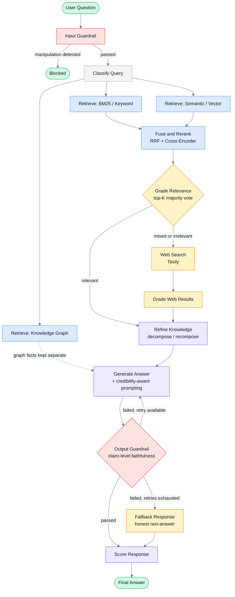

# Corrective Agentic RAG for Knowledge Retrieval

A retrieval-augmented generation system for answering questions about Databricks Unity Catalog documentation. It combines keyword search, semantic search, and a knowledge graph, grades its own retrieval quality before answering, and falls back to a live web search when the internal documentation doesn't cover a question. Two guardrail layers and a bounded retry mechanism keep it from handing back an ungrounded answer, and it ships with a Gradio interface, offline and ad-hoc evaluation via RAGAS, and LangSmith tracing for observability.

## Grading Retrieval Before Answering

Most RAG systems retrieve once and generate, trusting whatever came back. This system grades its own retrieval before committing to an answer. Every retrieved chunk is judged relevant or not, and that verdict decides what happens next: if the internal corpus genuinely covers the question, the system answers from it directly. If it doesn't, or only partially does, the system falls back to a real-time web search, grades those results too, and blends whatever passed grading into the final answer. If the resulting answer still can't be verified as grounded, the system retries generation once, and if that also fails, it returns an honest message saying so rather than guessing.

## Architecture

The system is built as a LangGraph state machine, thirteen or more nodes depending on which path a given question takes, all operating on one shared state object (`CRAGState`).



A single query moves through the graph roughly as follows.

**Input guardrail.** Checks the raw question for prompt injection or manipulation attempts specifically, not topic relevance. An off-topic-but-genuine question is allowed through; retrieval and generation are better equipped to say "I don't have information on that" than a pre-retrieval classifier is to guess.

**Classify query.** Decides whether the question would benefit from graph-based retrieval in addition to the standard text and semantic search, which always run. A relationship or hierarchy question ("what does X require") routes to the graph; a straightforward procedural question doesn't, since graph retrieval has its own real cost, an entity-extraction call plus a Neo4j traversal, not worth paying on every query.

**Parallel retrieval.** BM25 keyword search, ChromaDB semantic search, and Neo4j graph traversal run concurrently. BM25 and semantic search return document chunks; the graph returns structured relationship facts (source, relation, target, evidence) kept separate from the chunk-based retrievers, since graph relevance is structural, not a similarity ranking, and doesn't fuse cleanly with rank-based retrieval.

**Fuse and rerank.** BM25 and semantic results are combined with reciprocal rank fusion (RRF, k=60), then the fused shortlist is rescored by a local cross-encoder (`BAAI/bge-reranker-base`), which reads the query and each candidate chunk together in one pass rather than comparing precomputed embeddings, a more accurate but more expensive signal, which is why it only runs on the already-narrowed shortlist.

**Grade relevance.** Each of the top reranked chunks is graded independently, in parallel, against the question. The vote is weighted toward the reranker's own ordering: only the top four chunks count toward the majority decision, since the reranker already identified which ones matter most, and letting a low-ranked, tangentially related chunk outvote a highly relevant top chunk wastes that signal. The result is one of three routes: relevant, mixed, or irrelevant.

**Web search fallback.** Runs only on a mixed or irrelevant route. Queries Tavily, grades each result the same way internal chunks are graded, and classifies each source's domain as official Databricks or Microsoft documentation, Databricks Community, or third-party, a distinction that later shapes how confidently the answer can state a claim drawn from it.

**Refine knowledge.** For each chunk that survived grading, whether internal or web-sourced, extracts only the sentences genuinely relevant to the question, verbatim, discarding the rest even within an otherwise-good chunk. This is a decompose-then-recompose step, not the same as whole-chunk relevance grading; a chunk can be mostly on-topic with one tangential sentence that shouldn't reach generation.

**Generate.** Synthesizes the final answer from the refined context plus any graph facts, using two separate calls, one for the answer text, one for citations, since combining both in a single forced tool call proved to occasionally corrupt the model's output during testing. Web-sourced content is labeled with its credibility tier directly in the prompt, and the model is instructed to prefer official sources and explicitly hedge any claim that rests only on a community or third-party one.

**Output guardrail.** Decomposes the generated answer into individual factual claims and checks each one against the exact context the answer was actually built from, not a narrower subset. Produces a genuine graded score (claims supported over claims total), not a boolean. If the score falls below a threshold, the graph loops back to generate for one more attempt at the same context; if that also fails, a fallback node returns an explicit, honest message instead of an unverified answer.

**Score response.** Computes two lightweight, in-graph quality signals: context relevance (the fraction of graded chunks that were relevant, no extra call needed) and answer relevancy (one direct LLM judgment of whether the answer addresses the question). These are separate from, and computed differently than, the offline RAGAS metrics described below.

## Data

The system is grounded entirely in five Databricks documentation pages, saved as image-only PDFs (hence the OCR step in ingestion, there's no extractable text layer in the source files). Every answer is expected to trace back to one or more of these.

| File | Title | Pages |
|---|---|---|
| `Document_1.pdf` | Database objects in Databricks | 7 |
| `Document_2.pdf` | Unity Catalog privileges reference | 38 |
| `Document_3.pdf` | Unity Catalog permissions model concepts | 14 |
| `Document_4.pdf` | Connect to a SQL warehouse | 5 |
| `Document_5.pdf` | Databricks SQL release notes 2024 | 35 |

## Retrieval routing cases

Two separate decisions shape how a given question is actually retrieved and answered, worth understanding distinctly rather than as one combined behavior.

**Which retrievers run.** BM25 and semantic search run on every question unconditionally. Graph retrieval is conditional, `classify_query` only enables it for questions that plausibly hinge on a relationship or requirement between entities ("what does X require," "how does Y relate to Z"), since graph retrieval carries its own real cost, an entity-extraction call plus a Neo4j traversal, not worth paying on a question like "how do I connect to a SQL warehouse," where nothing about the question depends on understanding relationships between entities.

**What happens with what comes back.** Once BM25 and semantic results are fused, reranked, and graded, the outcome falls into one of three cases.

| Route | Condition | What happens |
|---|---|---|
| `relevant` | More than half of the top four reranked chunks graded relevant | Internal corpus answers the question directly. No web search. |
| `mixed` | Some, but not a majority, of the top four graded relevant | Web search runs to supplement. The final answer blends whatever internal chunks passed grading with whatever web results also passed grading. |
| `irrelevant` | None of the top four graded relevant | Web search runs and effectively becomes the sole source. Internal chunks are excluded from refinement entirely; the answer is built only from web results that passed their own grading. |

Only the top four reranked chunks count toward this decision, not the full eight-chunk shortlist. That's a deliberate design choice, not an oversight: real testing during development showed a single genuinely correct, highly-ranked chunk repeatedly losing a full-list majority vote to several lower-ranked, tangentially related chunks that shared keywords with the question without actually answering it. Since the reranker already sorts candidates best-first, trusting only its top picks uses that signal instead of diluting it against noise further down the list.

## What's used

| Layer | Technology |
|---|---|
| LLM | Claude Sonnet 5 (generation, extraction), Claude Haiku 4.5 (grading, guardrails, classification) |
| Orchestration | LangGraph |
| Keyword search | BM25 (`rank_bm25`) |
| Semantic search | ChromaDB, `sentence-transformers` embeddings |
| Reranking | `BAAI/bge-reranker-base` cross-encoder |
| Knowledge graph | Neo4j (AuraDB) |
| Web search | Tavily |
| Evaluation | RAGAS, judged by Claude Sonnet (a separate model generation from the pipeline's own, to sidestep a real API incompatibility between RAGAS's internal calls and the pipeline's primary model) |
| Observability | LangSmith tracing, a local per-query cost and token tracker |
| Interface | Gradio |
| PDF ingestion | PyMuPDF and OCR-based extraction (the source corpus is image-only PDFs) |

## Project structure

```
app.py                          Gradio interface
scripts/
  ingest.py                     Full-corpus ingestion: BM25 index, Chroma embeddings, optional graph extraction

src/crag/
  config.py                     Environment variable loading
  schema.py                     CRAGState (the LangGraph state) and ChunkMetadata

  ingestion/
    pdf_extract.py               Raw PDF text extraction
    ocr_utils.py                 OCR pipeline for image-only PDFs
    chunker.py                   Structure-aware chunking (Chunk, Section dataclasses)
    embed_index.py               ChromaDB embedding and semantic query
    bm25_index.py                BM25 index build, persistence, and query
    graph_schema.py              Controlled vocabulary for graph extraction (NODE_TYPES, EDGE_TYPES)
    graph_extract.py             LLM-based relationship extraction and Neo4j writes

  retrieval/
    reranker.py                  Cross-encoder reranking
    fusion.py                    Reciprocal rank fusion
    graph_retrieve.py            Neo4j read path (entity extraction, graph traversal)
    tavily_search.py             Web search fallback
    source_credibility.py        Domain-based credibility classification for web sources

  graph/
    build_graph.py               Assembles the LangGraph StateGraph
    nodes.py                     Every node function
    edges.py                     Conditional routing logic
    classify_query.py            Retriever selection logic
    grade_relevance.py           Per-chunk relevance grading and route decision
    grade_web_results.py         Relevance grading for web results
    refine_knowledge.py          Decompose-then-recompose knowledge refinement
    generate.py                  Answer generation with credibility-aware prompting
    score_response.py            In-graph context relevance and answer relevancy scoring

  guardrails/
    guardrail_schema.py          Shared result schema
    input_guardrail.py           Prompt injection / manipulation detection
    output_guardrail.py          Claim-level faithfulness checking

  observability/
    anthropic_client.py          Shared, LangSmith-traced Anthropic client factory
    usage_tracker.py             Per-query cost and token tracking

  eval/
    run_eval.py                  Offline evaluation over a fixed question set
    ragas_metrics.py             RAGAS scoring wrapper

data/
  raw_pdfs/                      Source documentation (five Databricks pages)
  bm25_index.pkl                 Persisted BM25 index
```

## Installation

Requires Python 3.11+ and [uv](https://docs.astral.sh/uv/).

```powershell
uv sync
```

Create a `.env` file in the project root with the following:

```
ANTHROPIC_API_KEY=

NEO4J_URI=
NEO4J_USERNAME=
NEO4J_PASSWORD=

TAVILY_API_KEY=

LANGSMITH_TRACING=true
LANGSMITH_API_KEY=
LANGSMITH_PROJECT=corrective-agentic-rag
```

`ANTHROPIC_API_KEY` is required for every LLM call in the system. `NEO4J_*` requires a running Neo4j instance (AuraDB Free works). `TAVILY_API_KEY` powers the web search fallback. The `LANGSMITH_*` variables are optional; tracing is simply disabled if they're unset.

## Ingesting the corpus

Before running the app for the first time, build the BM25 and Chroma indexes:

```powershell
uv run python scripts/ingest.py
```

This OCRs and chunks all five source documents, builds and saves the BM25 index, and embeds every document into ChromaDB. Graph extraction is a separate, explicit step, since it makes one Claude call per chunk across the full corpus and costs real API usage:

```powershell
uv run python scripts/ingest.py --include-graph
```

## Running the app

```powershell
uv run python app.py
```

Opens a local Gradio interface with three tabs: a question-and-answer interface showing the answer, citations, route (relevant, mixed, or web-search-only), and per-query cost and latency; an evaluation tab that scores the most recently asked question with RAGAS (faithfulness and answer relevancy only, since RAGAS's context precision and recall both require a pre-written reference answer an ad-hoc question doesn't have); and a pipeline trace tab showing a step-by-step breakdown of exactly which nodes ran and what each one decided.

## Metrics

Two genuinely separate metric systems exist in this project, not one metric shown in two places. They measure similar-sounding things through different methods, computed by different models, and can legitimately disagree with each other. Confusing the two, or expecting them to match, is a real mistake worth avoiding.

### Live, in-graph metrics

Computed on every single query, shown directly in the app's answer view and pipeline trace.

| Metric | Computed by | Method |
|---|---|---|
| `faithfulness_score` | `output_guardrail_node` | Decomposes the answer into individual factual claims, checks each against the exact context the answer was generated from, and scores the fraction supported. This score, thresholded at 0.7, is also what decides whether the answer passes the output guardrail. |
| `context_relevance_score` | `score_response_node` | Deterministic, no model call: the fraction of the top-K reranked chunks that were graded relevant during retrieval. |
| `answer_relevancy_score` | `score_response_node` | One direct judgment from Claude Haiku on whether the answer addresses the question asked, independent of whether it's grounded. |
| `citation_valid` | `output_guardrail_node` | Deterministic, no model call: whether every chunk_id the answer cited actually exists among the chunks that were retrieved. |
| `guardrail_retry_count` | `output_guardrail_node` | How many times the output guardrail rejected an answer within this one query, capped at one retry before falling back to an explicit non-answer. |
| `route` | `grade_relevance_node` | relevant, mixed, or irrelevant, see Retrieval routing cases above. |
| Cost, latency, token counts | `usage_tracker.py` | Computed locally in real time from the actual token usage on every real Anthropic API response for that query, not estimated. Tavily's own search cost isn't included, since it's priced separately and goes through a different client. |

### Offline and ad-hoc metrics (RAGAS)

A structurally different system, using the `ragas` library's own metric implementations rather than this project's custom scoring logic, judged by a separate Claude Sonnet generation from the one the pipeline itself uses (a deliberate workaround for a real incompatibility between `ragas`'s internal calls and the pipeline's primary model, documented in the design notes below).

| Metric | Needs a reference answer? | Method |
|---|---|---|
| Faithfulness | No | `ragas`'s own claim decomposition, a different implementation from this project's `compute_faithfulness_score`, can and does produce a different score on the same answer. |
| Answer Relevancy | No | Generates several synthetic questions the given answer seems to be answering, then measures their embedding similarity to the original question. Genuinely different math from the in-graph version's direct LLM judgment, not just a different prompt. |
| Context Precision | Yes | Judges whether the retrieved chunks were actually useful for producing the reference answer. |
| Context Recall | Yes | Judges whether the retrieved chunks covered everything the reference answer needed. |

Two ways this runs, with a real difference in which metrics are available.

**Offline benchmark**, a fixed, small question set with hand-written reference answers, useful for comparing whether a change to the pipeline improved or hurt overall quality over time:

```powershell
uv run python -m crag.eval.run_eval
```

Runs all four metrics, since these questions have real references to judge context precision and recall against. Spans three categories deliberately: a direct fact lookup, a relationship question that exercises graph retrieval, and one deliberately outside the corpus to exercise the web fallback.

**Ad-hoc scoring**, built into the app's Evaluation tab, scores whatever question was most recently asked in the main tab, reusing the answer already generated rather than running the pipeline again. Only Faithfulness and Answer Relevancy are computed here, Context Precision and Context Recall are both skipped entirely, since neither can be judged meaningfully without a pre-written reference answer, and an ad-hoc question typed live has no such thing.

## Design notes and known limitations

The output guardrail's pass threshold (currently 0.7 of claims supported) is a judgment call, not a value derived from any formal analysis, tuned after real testing showed a stricter threshold rejecting genuinely well-grounded answers over minor, defensible interpretive claims.

Graph facts are passed to generation as supplementary context but aren't tracked in citations the way chunks are, so there's currently no way to confirm from the UI alone whether a graph fact actually influenced a given answer versus simply being present and unused.

Tavily's own search cost isn't included in the displayed per-query cost, since it's priced separately from token usage and goes through a different client than the one cost tracking hooks into.

The `langsmith` package's `wrap_anthropic` client wrapper is incompatible with the installed `anthropic` SDK version as of this writing (it references a legacy API surface the current SDK no longer exposes), so tracing is implemented with a `@traceable`-decorated function instead, which produces less richly formatted traces in the LangSmith dashboard than the intended approach would.
